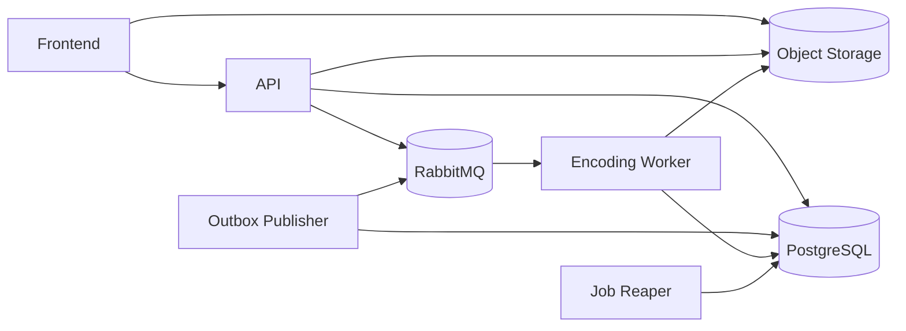

# Rendition

Rendition is a distributed video transcoding system. It accepts large video
uploads, stores the source video in S3-compatible object storage, queues encoding
jobs, generates HLS renditions with `ffmpeg`, and publishes a master playlist for
playback.

The local stack uses FastAPI, PostgreSQL, RabbitMQ, MinIO, a Python worker, an
outbox publisher, and a Next.js frontend.

## What It Does

- Direct browser-to-object-storage multipart uploads using presigned URLs.
- Upload validation for file size, content type, part count, part ordering, and
  ETags.
- Upload completion verification against object metadata before work is queued.
- One encoding job per target rendition.
- RabbitMQ job publishing through an outbox so jobs are not lost if RabbitMQ is
  temporarily unavailable.
- Worker-side job claiming with ownership, heartbeats, and manual ack/nack
  behavior.
- Stale job recovery through a reaper that returns abandoned running jobs to the
  retry flow.
- Bounded job retries with backoff and RabbitMQ dead-letter routing for terminal
  worker failures.
- Source probing with `ffprobe` for width, height, bitrate, and duration.
- HLS encoding with `ffmpeg` for 1080p, 720p, 480p, 360p, 240p, and 144p
  presets.
- Source-aware rendition skipping. For example, a 720p source will not create a
  1080p output.
- HLS segment and rendition playlist upload to object storage.
- Master playlist generation at `hls/{video_id}/master.m3u8`.
- API-backed playback URLs so the frontend does not construct object-storage
  URLs directly.
- Request IDs and consistent API error responses.
- A dashboard UI for uploads, progress, cancellation, retry, uploaded video
  status, and HLS playback for completed videos.

## Architecture



### Services

- `frontend`: Next.js app for upload testing and video/dashboard views.
- `api`: FastAPI service exposing health checks, upload APIs, and video APIs.
- `worker`: consumes encoding jobs and runs `ffprobe`/`ffmpeg`.
- `reaper`: marks stale running jobs retryable when workers stop heartbeating.
- `outbox`: periodically publishes pending queue messages from PostgreSQL to
  RabbitMQ.
- `postgres`: application database.
- `rabbitmq`: job queue.
- `minio`: local S3-compatible object storage for development.
- `minio-init`: creates the private local bucket.

## Upload And Encoding Flow

1. The frontend asks the API for upload limits and allowed content types.
2. The frontend starts an upload with filename, content type, size, and part
   count.
3. The API creates a `Video`, an `UploadSession`, and a multipart upload in
   object storage.
4. The frontend uploads each chunk directly to MinIO/S3 with presigned part URLs.
5. The frontend completes the upload by sending part numbers and ETags to the
   API.
6. The API completes the multipart upload and verifies object size/content type.
7. The API creates renditions, jobs, and outbox messages in the database.
8. The API attempts immediate queue publishing; the outbox service retries any
   pending messages every 30 seconds.
9. The worker claims a pending job, records ownership, starts heartbeating, then
   downloads the source video and probes it.
10. If the requested rendition is not valid for the source, the rendition is
    marked `skipped`.
11. Valid renditions are encoded to HLS in a temporary per-job directory.
12. Before uploading HLS output, the worker verifies it still owns the job so a
    stale worker cannot overwrite files after another worker reclaimed the job.
13. The worker uploads HLS segments and the rendition playlist.
14. Failed jobs are retried with backoff until attempts are exhausted.
15. The reaper moves stale running jobs back into the retry flow after the
    heartbeat timeout.
16. Once all rendition work is terminal, a master playlist is generated and
    uploaded.
17. `videos.playback_path` points at the master playlist.
18. The frontend asks the API for playback metadata and uses the returned
    playlist URL.

## Local Development

The local setup runs with:

- FastAPI API
- Next.js frontend
- PostgreSQL
- RabbitMQ
- MinIO
- Python encoding worker
- Job reaper
- Outbox publisher


Create your local environment file:

```bash
cp .env.example .env
```

Start everything:

```bash
docker compose up --build
```

Apply migrations:

```bash
uv run alembic upgrade head
```

Open:

- Frontend: `http://localhost:3000`
- API docs: `http://localhost:8000/docs`
- MinIO console: `http://localhost:9001`
- RabbitMQ console: `http://localhost:15672`

Default local credentials from `.env.example`:

```text
Postgres:  rendition / rendition
RabbitMQ:  rendition / rendition
Object storage: rendition / rendition-secret
Bucket:    rendition
```

Useful local worker defaults:

```text
Worker queue: jobs.encode
Worker prefetch: 1
Worker heartbeat interval: 60 seconds
Job stale timeout: 300 seconds
Retry backoff: 30, 120, 600 seconds
```

## Production Deployment

Use `docker-compose.prod.yml` when object storage is provided externally by AWS
S3, Cloudflare R2, or another S3-compatible provider.

Create a production environment file with working database, RabbitMQ, and
storage credentials, then start the stack with:

```bash
docker compose -f docker-compose.prod.yml up --build
```

At minimum, the production environment should provide:

```text
POSTGRES_HOST=...
POSTGRES_PORT=5432
POSTGRES_DB=...
POSTGRES_USER=...
POSTGRES_PASSWORD=...

RABBITMQ_DEFAULT_USER=...
RABBITMQ_DEFAULT_PASS=...

STORAGE_ENDPOINT=...
STORAGE_PRESIGN_ENDPOINT=...
STORAGE_ACCESS_KEY_ID=...
STORAGE_SECRET_ACCESS_KEY=...
STORAGE_BUCKET=...
STORAGE_REGION=...

WORKER_JOB_RETRY_COUNT=3
WORKER_HEARTBEAT_INTERVAL_SECONDS=60
JOB_REAPER_INTERVAL_SECONDS=120
JOB_STALE_TIMEOUT_SECONDS=300
JOB_RETRY_BACKOFF_SECONDS=30,120,600
```

Typical production flow:

1. Create the object storage bucket ahead of time.
2. Prepare the production environment file or exported environment variables.
3. Start the stack with `docker compose -f docker-compose.prod.yml up --build -d`.
4. Run database migrations with `uv run alembic upgrade head`.
5. Verify the API health endpoint and frontend before sending traffic.

Unlike the local stack, the production compose file does not provision MinIO or
create a bucket for you. It assumes PostgreSQL, RabbitMQ, and your
S3-compatible storage are already available and correctly configured.
