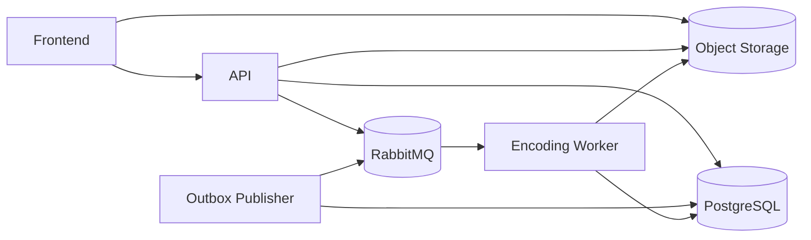

# Rendition

Rendition is a distributed video transcoding system. It accepts large video
uploads, stores the source video in S3-compatible object storage, queues encoding
jobs, generates HLS renditions with `ffmpeg`, and publishes a master playlist for
playback.

The local stack uses FastAPI, PostgreSQL, RabbitMQ, MinIO, a Python worker, an
outbox publisher, and a Next.js frontend.

## What It Does

- Direct browser-to-object-storage multipart uploads using presigned URLs.
- Upload validation for file size, content type, part count, part ordering, and
  ETags.
- Upload completion verification against object metadata before work is queued.
- One encoding job per target rendition.
- RabbitMQ job publishing through an outbox so jobs are not lost if RabbitMQ is
  temporarily unavailable.
- Worker-side job claiming with manual ack/nack behavior.
- Source probing with `ffprobe` for width, height, bitrate, and duration.
- HLS encoding with `ffmpeg` for 1080p, 720p, and 480p presets.
- Source-aware rendition skipping. For example, a 720p source will not create a
  1080p output.
- HLS segment and rendition playlist upload to object storage.
- Master playlist generation at `hls/{video_id}/master.m3u8`.
- Partial playback support when at least one rendition succeeds.
- Request IDs and consistent API error responses.
- A dashboard UI for uploads, progress, cancellation, retry, and uploaded video
  status.

## Architecture



### Services

- `frontend`: Next.js app for upload testing and video/dashboard views.
- `api`: FastAPI service exposing health checks, upload APIs, and video APIs.
- `worker`: consumes encoding jobs and runs `ffprobe`/`ffmpeg`.
- `outbox`: periodically publishes pending queue messages from PostgreSQL to
  RabbitMQ.
- `postgres`: application database.
- `rabbitmq`: job queue.
- `minio`: local S3-compatible object storage.
- `minio-init`: creates the private local bucket.

## Upload And Encoding Flow

1. The frontend asks the API for upload limits and allowed content types.
2. The frontend starts an upload with filename, content type, size, and part
   count.
3. The API creates a `Video`, an `UploadSession`, and a multipart upload in
   object storage.
4. The frontend uploads each chunk directly to MinIO/S3 with presigned part URLs.
5. The frontend completes the upload by sending part numbers and ETags to the
   API.
6. The API completes the multipart upload and verifies object size/content type.
7. The API creates renditions, jobs, and outbox messages in the database.
8. The API attempts immediate queue publishing; the outbox service retries any
   pending messages every 30 seconds.
9. The worker claims a pending job, downloads the source video, and probes it.
10. If the requested rendition is not valid for the source, the rendition is
    marked `skipped`.
11. Valid renditions are encoded to HLS in a temporary per-job directory.
12. The worker uploads HLS segments and the rendition playlist.
13. Once all rendition work is terminal, a master playlist is generated and
    uploaded.
14. `videos.playback_path` points at the master playlist.

## Run Locally With MinIO

The local setup runs with:

- FastAPI API
- Next.js frontend
- PostgreSQL
- RabbitMQ
- MinIO
- Python encoding worker
- Outbox publisher


Create your local environment file:

```bash
cp .env.example .env
```

Start everything:

```bash
docker compose up --build
```

Apply migrations:

```bash
uv run alembic upgrade head
```

Open:

- Frontend: `http://localhost:3000`
- API docs: `http://localhost:8000/docs`
- MinIO console: `http://localhost:9001`
- RabbitMQ console: `http://localhost:15672`

Default local credentials from `.env.example`:

```text
Postgres:  rendition / rendition
RabbitMQ:  rendition / rendition
MinIO:     rendition / rendition-secret
Bucket:    rendition
```

## Upload Flow

1. Open the frontend.
2. Drop or select a video.
3. The API creates a multipart upload in MinIO.
4. The browser uploads chunks directly to MinIO using presigned URLs.
5. The API completes the multipart upload.
6. Encoding jobs are queued.
7. The worker downloads the source video, probes it, encodes HLS renditions, and
   uploads the outputs.
8. When the usable renditions are finished, the app creates:

```text
hls/{video_id}/master.m3u8
```


## Use Your Own S3-Compatible Provider

MinIO is only the local object storage. In production or remote testing, point
the same storage layer at another S3-compatible provider such as AWS S3,
Cloudflare R2, or another MinIO deployment.

Set these values in `.env`:

```text
STORAGE_ENDPOINT=https://your-s3-api-endpoint
STORAGE_PRESIGN_ENDPOINT=https://your-public-upload-endpoint
STORAGE_ACCESS_KEY_ID=your-access-key
STORAGE_SECRET_ACCESS_KEY=your-secret-key
STORAGE_BUCKET=your-bucket
STORAGE_REGION=auto-or-provider-region
```

For AWS S3, `STORAGE_ENDPOINT` can be the normal AWS S3 endpoint for your
region.

For Cloudflare R2, use the R2 S3 API endpoint:

```text
STORAGE_ENDPOINT=https://<account-id>.r2.cloudflarestorage.com
STORAGE_PRESIGN_ENDPOINT=https://<account-id>.r2.cloudflarestorage.com
STORAGE_REGION=auto
```

Keep the bucket private. The browser receives temporary presigned upload URLs,
and playback should later be served through signed URLs or a CDN layer.
